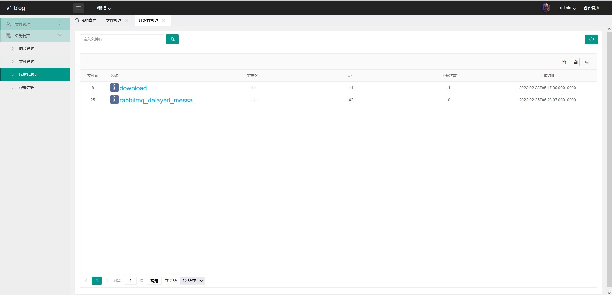

# springboot文件管理

## 项目介绍

- **该项目实现简易网盘功能**
- **可进行多文件上传和文件下载功能**
- **可进行文件夹的删除和文件的删除**

## 使用说明

- **准备数据库文件目录为```sql/filecontorller.sql```**

- **搭建FTP服务器（可根据阿里云建站指南中的文档）**

- **文件后台管理系统的默认登陆账号为 admin 默认登陆密码为 password**

- **用户头像存储在配置文件中的upload属性上**


## 技术栈
- springboot
- layui
- FTP服务器
- mybatis-plus

### 后台管理页面

- 登录页,注册页

	

- 首页

	

- 文件管理

	

- 用户修改

	

- 上传文件页面

	

- 图片管理

	

- 文档管理

	

- 压缩包管理

		
## 感谢提供框架思路

- [Linn-cn](https://github.com/Linn-cn)
- [sentsin](https://github.com/sentsin/layui)
- [spring-projects](https://github.com/spring-projects/spring-boot)
- [zjhch123](https://github.com/zjhch123/solo-skin-amaze)


